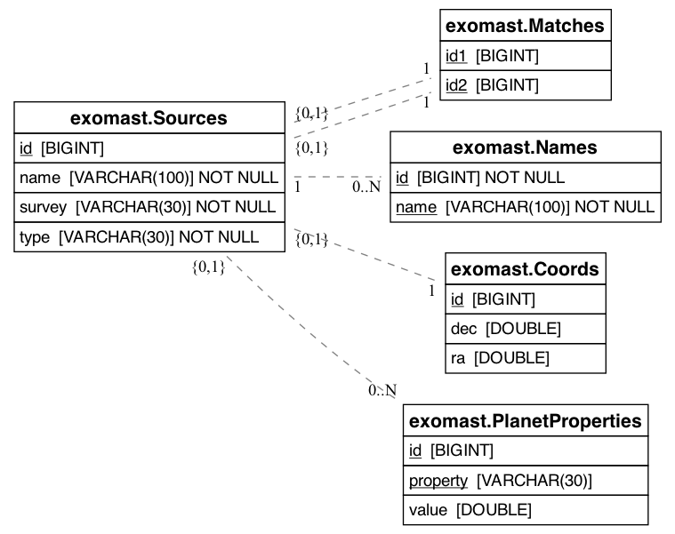

# Exomast Felis

## Getting started

Create a python 3.11 or higher environment

Install package dependencies: `pip install -r requirements.txt`

Validate the schema and produce a sqlite file with `pytest`

If you want to generate ER diagrams you may need to do `conda install -c conda-forge eralchemy2` as it has extra dependencies (graphviz)

## Database design

